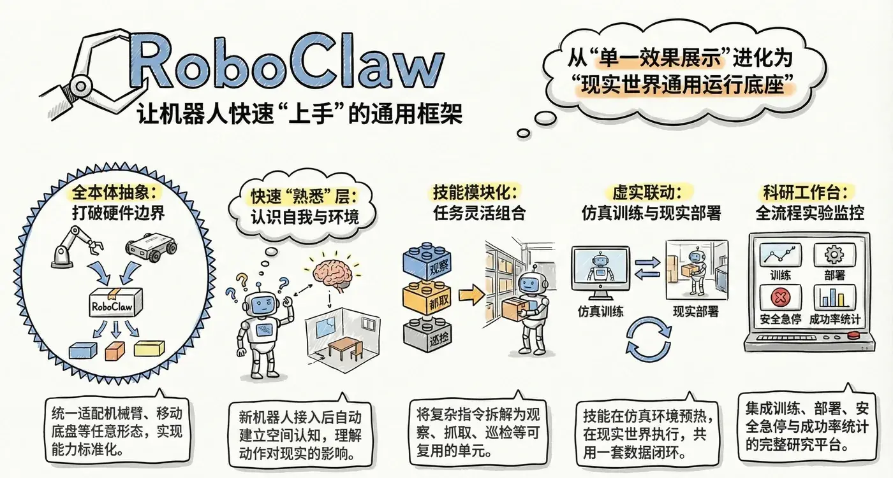
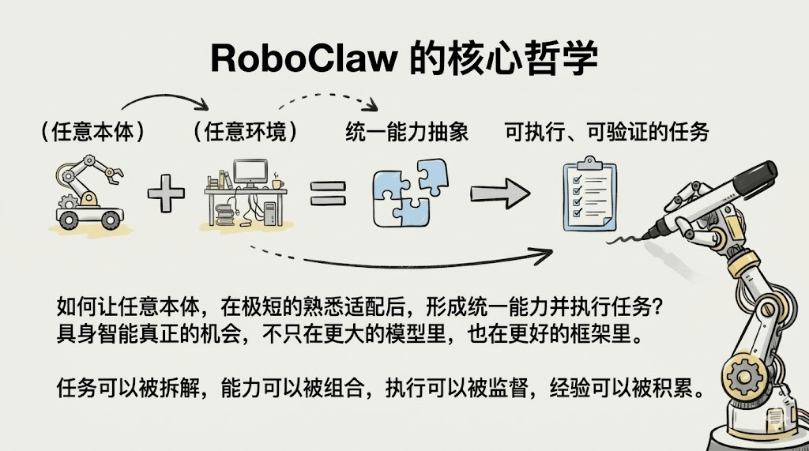
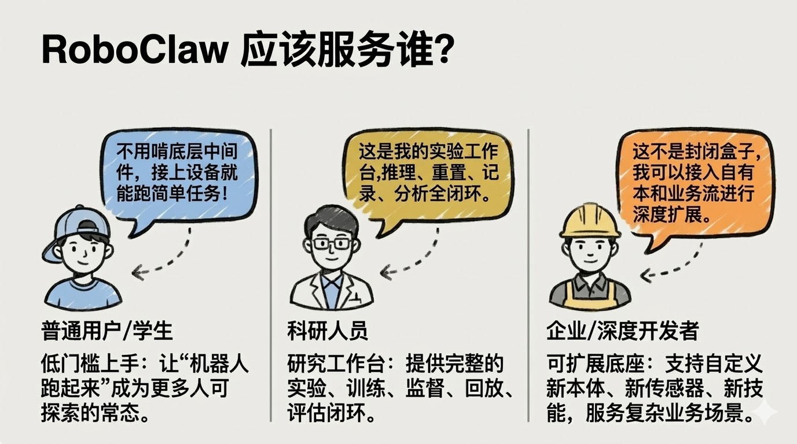

# RoboClaw：首个面向具身智能的AI助手

上海交通大学 MINT 实验室  
2026-03-11

我们推出首个面向具身智能的AI助手，邀请开发者加入社区共建，项目地址：https://github.com/MINT-SJTU/RoboClaw.

先说明白一件事：RoboClaw 还在非常早期的阶段。

它最后会长成什么样，现在谁都不知道。我们能确定的，只是一个方向：做一个真正面向本体、环境和任务迁移的 AI 助手。

所以这篇文章不是宣布完成，而是把当前的判断和结构摊开，也希望更多人一起把这件事做成。

这两年，具身智能很热。真机、VLA、世界模型、仿真训练都在快速推进。

但真到落地时，一个问题始终没有被很好解决：

> **当本体变了、传感器变了、环境变了、任务变了，系统、技能和记忆还能不能快速迁移？**

我们做 **RoboClaw**，就是想回答这个问题。

> **RoboClaw 不是给某一台机器人包一层智能体外壳，也不是把 OpenClaw 直接接上机器人接口。**  
> **它要做的是一个面向任意本体、任意环境、任意任务的具身智能AI助手。**

OpenClaw 给了我们一个很重要的起点：作为个人AI助手，它已经把节点接入、会话管理、工具编排和多入口交互组织成了一个完整系统。

但机器人系统比数字世界的助手更复杂。它有本体、有传感器、有运动学、有空间约束、有安全边界，也会在真实世界里出错。

## 我们现在认同的架构

**1. 助手层**：负责用户、会话、智能体编排、工具路由和远程接入。

**2. 具身层**：这是 RoboClaw 最核心的一层，重点不是“接上机器人”，而是让系统真正理解这个身体。

- 本体建模：系统需要先明确关节、末端执行器、传感器和约束分别是什么。
- 空间建联：系统需要把坐标系、运动学、工作空间、安全边界和可达范围真正组织起来。
- 能力抽象：系统需要把底层硬件能力转成可组合的语义动作和能力图谱。
- 熟悉校准：系统需要让新本体在试探、校验和对齐之后逐步形成稳定认知。
- 训练辅助：系统还需要帮助人组织本体训练、判断急停时机、恢复本体和环境，并决定下一步如何继续。

**3. 执行层**：以 ROS2 作为执行中间层，负责连接控制器、消息通道、服务调用、动作执行，以及安全监督和状态回传。

**4. 载体层**：负责连接仿真环境与真实机器人，承接部署、验证和回传。

这里我们最看重的一点，是 **熟悉过程**。

一个新本体接进来，系统不应该假装自己立刻全懂。它应该先枚举关节和传感器，做小幅试探动作，建立动作和观测的对应关系，校验初始位、运动边界和方向，再形成当前状态下的能力图谱。

这也是我们为什么不希望把机器人差异都丢给提示词，更不希望大模型直接输出低级关节指令。更合理的链路应该是：

> **用户目标 -> 任务理解与技能选择 -> 动作协议与执行监督 -> ROS2 执行 -> 仿真或真机本体**

也就是说，RoboClaw 提供的不是一组预先写好的功能，而是一套构建这些语义动作和技能能力的方式，让同一套任务可以迁移到不同本体上，而不是每换一个机器人就重写一遍底层控制。

## 写在最后

如果一句话概括我们想做的事情，那就是：

> **RoboClaw 不是“机器人版 OpenClaw”。**  
> **它是沿着 OpenClaw 的助手系统思路，继续向真实世界延伸的具身智能AI助手。**

上海交通大学 MINT 实验室  
欢迎对具身智能、机器人系统、训练平台、技能AI助手与真实世界部署感兴趣的朋友交流与共创。

项目地址：https://github.com/MINT-SJTU/RoboClaw

---

当前是网页预览版导出的 Markdown 版本。
